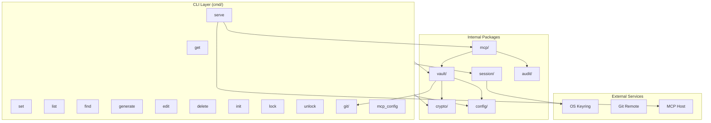
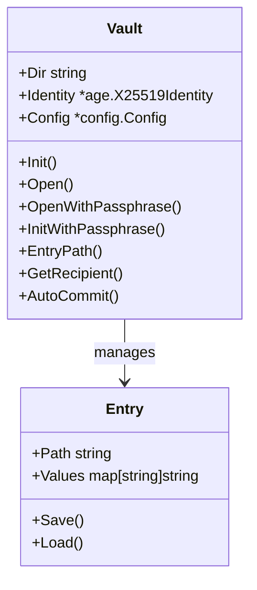
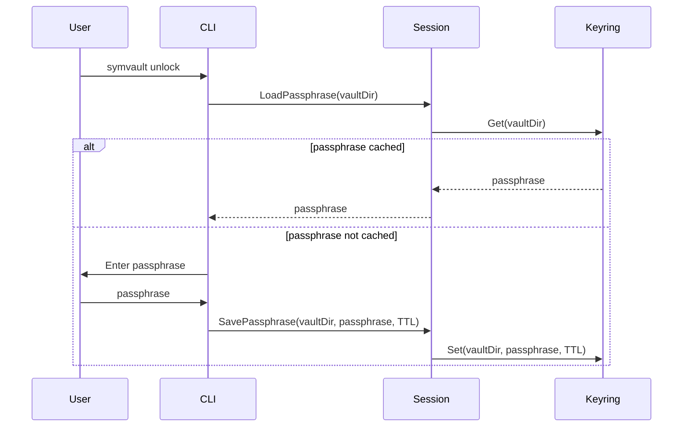
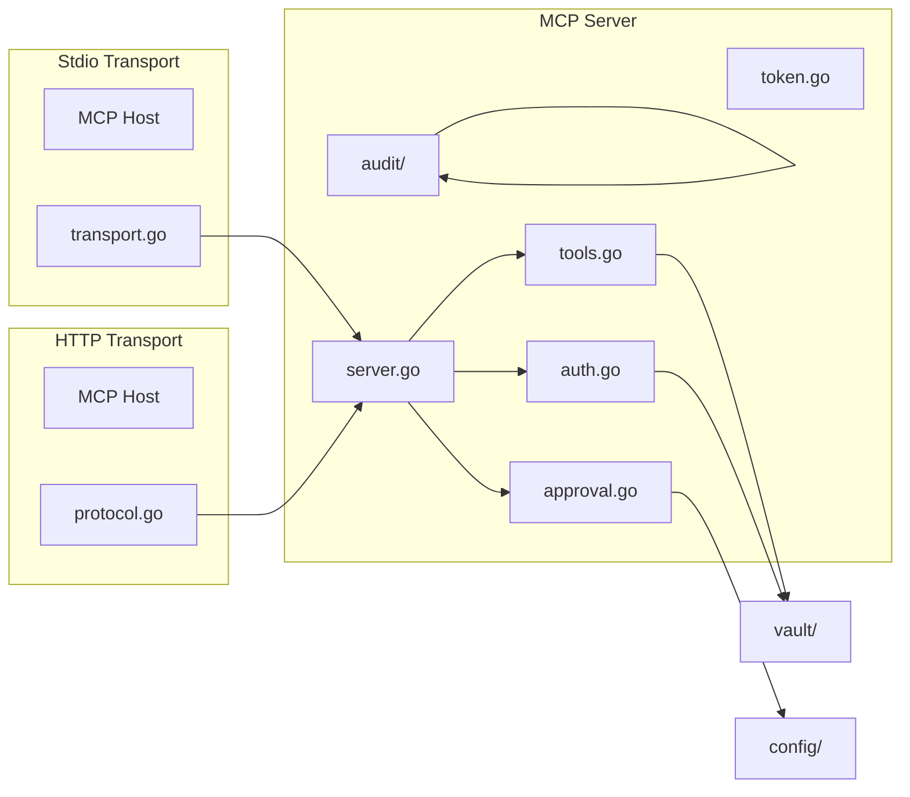
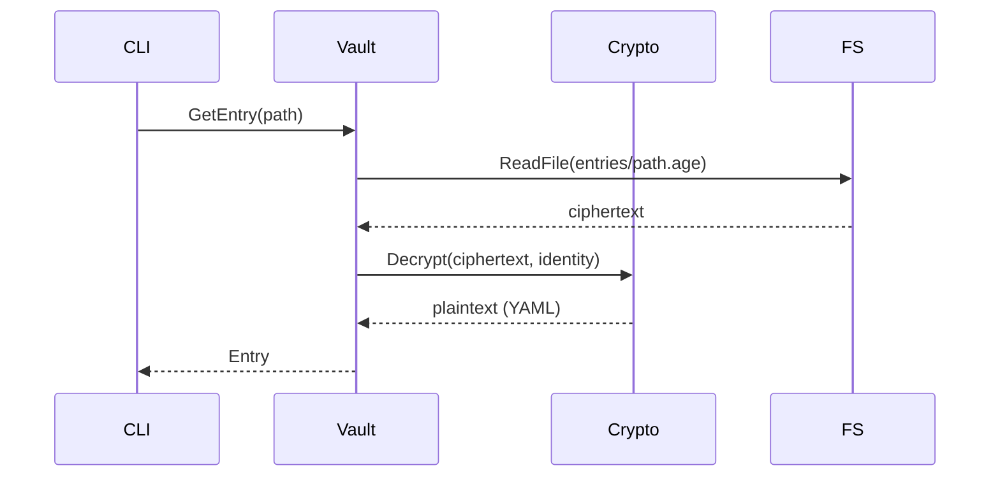
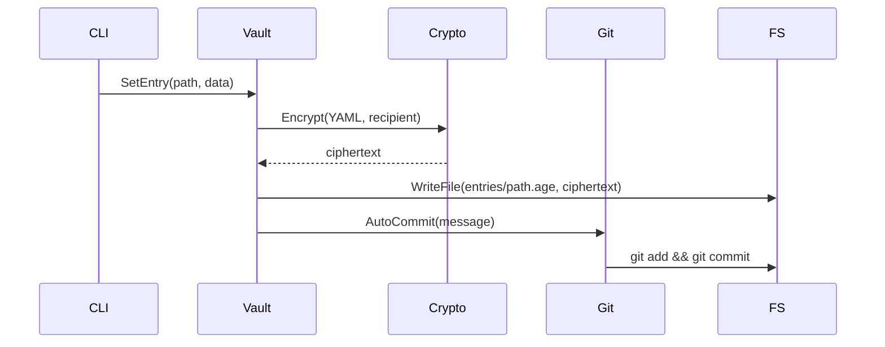
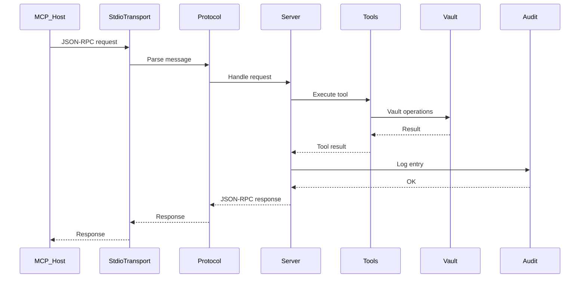
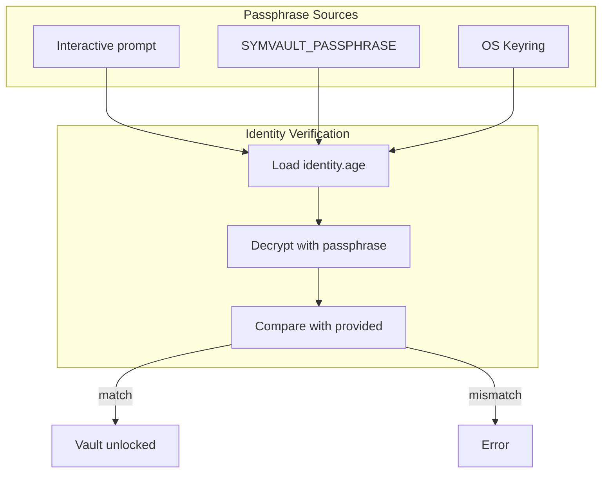

# Symaira Vault Architecture

This document describes the system architecture of Symaira Vault, a modern command-line password manager written in Go.

## Overview

Symaira Vault is a CLI password manager that uses [age](https://age-encryption.org/) encryption for securing vault entries. It provides a traditional command-line interface for human users and an MCP (Model Context Protocol) server for AI agent integration.



## Package Structure

```
main.go → cmd/ → internal/
```

### `cmd/` — CLI Commands

The `cmd/` package implements the Cobra CLI interface. Each file represents a command:

| Command | File | Description |
|---------|------|-------------|
| `get` | `get.go` | Retrieve password entries |
| `set` | `set.go` | Create/update entries |
| `list` | `list.go` | List vault entries |
| `find` | `find.go` | Search entries |
| `generate` | `generate.go` | Generate secure passwords |
| `delete` | `delete.go` | Delete entries |
| `edit` | `edit.go` | Edit entries in $EDITOR |
| `init` | `init.go` | Initialize new vault |
| `lock` | `lock.go` | Clear cached passphrase |
| `unlock` | `unlock.go` | Unlock vault |
| `serve` | `serve.go` | Start MCP server |
| `git` | `git.go` | Git operations |
| `recipients` | `recipients.go` | Manage recipient keys |
| `mcp_config` | `mcp_config.go` | Generate MCP config |
| `add` | `add.go` | Add new entries |
| `root.go` | `root.go` | Shared `unlockVault` helper |

### `internal/vault/` — Core Vault

The vault package is the central abstraction for encrypted storage.



**Key functions:**
- `Init(vaultDir, identity, config)` — Create new vault
- `Open(vaultDir, identity)` — Open existing vault
- `OpenWithPassphrase(vaultDir, passphrase)` — Open with passphrase
- `InitWithPassphrase(vaultDir, passphrase, config)` — Create with passphrase
- `EntryPath(vault, path)` — Get entry file path

**Entry storage:** Each entry is stored as an individually encrypted `.age` file under `<vault>/entries/<path>.age`. Older root-level entries are migrated into `entries/` when the vault opens and remain readable/listable for compatibility.

### `internal/crypto/` — Encryption Layer

Wraps [filippo.io/age](https://pkg.go.dev/filippo.io/age) for X25519+ChaCha20-Poly1305 encryption.

**Key functions:**
- `Encrypt(plaintext, recipient)` — Encrypt for single recipient
- `EncryptWithRecipients(plaintext, ...recipients)` — Multi-recipient encryption
- `Decrypt(ciphertext, identity)` — Decrypt with identity
- `EncryptWithPassphrase(plaintext, passphrase)` — Passphrase encryption (scrypt)
- `DecryptWithPassphrase(ciphertext, passphrase)` — Passphrase decryption
- `GenerateIdentity()` — Generate new X25519 identity
- `LoadIdentity(path, passphrase)` — Load passphrase-protected identity
- `SaveIdentity(identity, path, passphrase)` — Save identity with passphrase

### `internal/session/` — Session Management

OS keyring integration for passphrase caching.



**Default TTL:** 15 minutes

### `internal/config/` — Configuration

YAML-based configuration at `~/.symvault/config.yaml` or `~/.symvault/<vault>/config.yaml`.

**Config structure:**
```yaml
vaultDir: ~/.symvault
defaultAgent: claude-code
agents:
  claude-code:
    allowedPaths: ["*"]
    canWrite: true
    approvalMode: none
  readonly-agent:
    allowedPaths: ["work/*", "personal/*"]
    canWrite: false
    approvalMode: deny
git:
  autoCommit: true
  autoPush: false
  commitTemplate: ""
```

### `internal/git/` — Git Integration

Thin wrapper around `go-git` for automatic version control.

- `AutoCommitAndPush(dir, message, autoPush)` — Commit changes and optionally push
- Called automatically on vault modifications via `vault.AutoCommit()`

### `internal/mcp/` — MCP Server

Model Context Protocol server for AI agent access.

**Transports:**
- **stdio** (`--stdio --agent <name>`) — Fixed agent at startup
- **HTTP** (`--port 8080`) — Bearer token auth + per-request agent resolution



**Agent permissions:**
- `AllowedPaths` — Path glob patterns for entry access
- `CanWrite` — Whether write operations are allowed
- `ApprovalMode` — `none`, `deny`, or `prompt` (degrades to deny in MCP)

**Available tools:**
- `list_entries` — List vault entries
- `get_entry` — Retrieve entry
- `find_entries` — Search entries
- `set_entry_field` — Update entry field
- `generate_password` — Generate password
- `symvault_delete` — Delete entry

### `internal/audit/` — Audit Logger

Logs all MCP tool calls with:
- Agent name
- Action (read/write)
- Path accessed
- Transport used
- Timestamp
- Success/failure

### `internal/testutil/` — Test Helpers

Shared utilities for testing.

### `internal/clipboard/` — Clipboard Application Logic

Application-level clipboard utilities: auto-clear timer, countdown display, and cross-platform clipboard integration. Imported by CLI commands (e.g., `cmd/get.go`) as `clipboardapp`.

## Data Flow

### Vault Entry Read



### Vault Entry Write



### MCP Tool Call (stdio)



## Security Architecture

### Encryption

- **Algorithm:** age (X25519 key exchange + ChaCha20-Poly1305)
- **Identity protection:** `identity.age` encrypted with passphrase via scrypt
- **Entry encryption:** Each entry encrypted with vault's X25519 recipient
- **Multi-recipient:** Entries can be encrypted for additional recipients (shared access)

### Session Security



### MCP Security

- **Stdio:** Agent fixed at startup; process isolation provides security
- **HTTP:** Bearer token required; agent identified per-request via `X-Symaira Vault-Agent` header
- **Path restrictions:** Agents can only access allowed path patterns
- **Write restrictions:** `CanWrite: false` blocks all write operations
- **Approval modes:** `deny` blocks writes; `prompt` degrades to deny (no stdin)

## Vault Structure

```
~/.symvault/
├── identity.age      # Encrypted age identity
├── config.yaml       # Vault configuration
├── mcp-token         # Bearer token for HTTP MCP (auto-generated)
├── entries/          # Encrypted password entries
│   ├── github.age
│   └── work/
│       └── aws.age
└── .git/             # Git repository
```

Vaults created with the older root-level entry layout are migrated to `entries/` on open. Root-level encrypted entries remain readable and listable for compatibility.

## Key Design Decisions

1. **Individual entry encryption:** Each `.age` file is self-contained and decryptable independently
2. **Identity self-encryption:** `identity.age` is encrypted with the identity's own public key, protected by passphrase at the scrypt layer
3. **Passphrase never stored:** Only cached in OS keyring with TTL
4. **Build-tagged clipboard:** `internal/clipboard/` uses `//go:build` tags to switch between real clipboard (`!test_headless`) and no-op stub (`test_headless`)
5. **HTTP MCP token:** Auto-generated, stored at `<vault>/mcp-token`

## Dependencies

| Package | Purpose |
|---------|---------|
| filippo.io/age | Encryption (X25519 + ChaCha20-Poly1305) |
| spf13/cobra | CLI framework |
| zalando/go-keyring | OS keyring integration |
| go-git/go-git | Git integration |
| (internal/mcp) | MCP protocol — Symaira Vault implements its own MCP layer; no external mcp-go library is used |
| atotto/clipboard | Clipboard support |
