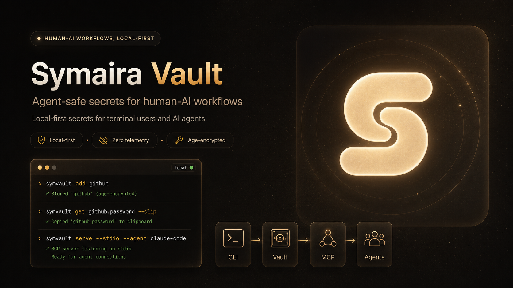
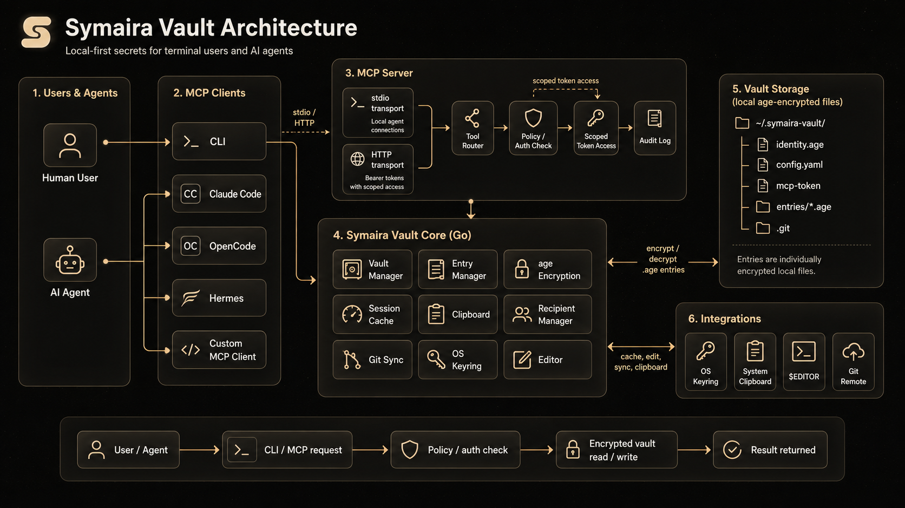

# Symaira Vault (symvault)

[](https://github.com/danieljustus/symaira-vault/actions/workflows/ci.yml)
[](https://github.com/danieljustus/symaira-vault/releases/latest)
[](https://opensource.org/licenses/Apache-2.0)
[](https://pkg.go.dev/github.com/danieljustus/symaira-vault)



A modern, secure command-line password manager written in Go. Uses [age](https://age-encryption.org/) for encryption with built-in MCP server support for AI agent integration.


> **Safety Notice**: Symaira Vault manages sensitive secrets. Use at your own risk, keep tested backups of your vault, and verify recovery before relying on it for critical credentials.

## Features

- **Modern Encryption**: [age](https://age-encryption.org/) (X25519 + ChaCha20-Poly1305)
- **TOTP Support**: Store and generate TOTP codes
- **Clipboard Auto-Clear**: Automatic clearing after timeout
- **Autotype**: Cross-platform automatic password entry (macOS, Linux, Windows)
- **Secret Execution**: Run commands with vault secrets injected as environment variables
- **Session Caching**: OS keyring with 15-minute TTL
- **Git Integration**: Automatic commits and sync
- **Multi-User Vaults**: age recipients for shared access
- **MCP Server**: stdio and HTTP for AI agent integration with scoped token management
- **MCP Slash Commands**: `add-credential`, `rotate-credential`, `find-and-use`, `share-credential` — guided workflows surfaced as slash commands in Claude Code, OpenCode, Hermes
- **Native Secure-Input Dialog**: cross-platform popups (macOS osascript, Linux zenity/kdialog, Windows Get-Credential) for collecting credentials from agents without exposing them in chat
- **Cross-Platform**: macOS, Linux, Windows, FreeBSD

## Installation

### Quick install

**macOS / Linux:**
```bash
curl -sSfL https://raw.githubusercontent.com/danieljustus/symaira-vault/main/scripts/install.sh | sh
```

**Windows:**
```powershell
irm https://raw.githubusercontent.com/danieljustus/symaira-vault/main/scripts/install.ps1 | iex
```

**Homebrew:**
```bash
brew tap danieljustus/tap
brew install symvault
```

**Scoop:**
```powershell
scoop bucket add symvault https://github.com/danieljustus/scoop-bucket
scoop install symvault
```

**Nix (Flake):**
```bash
# Run directly (no install needed)
nix run github:danieljustus/symaira-vault

# Or add as a flake input
# flake.nix:
#   inputs.symvault.url = "github:danieljustus/symaira-vault";
```
> **Note:** The flake is new. Go module dependencies are pinned via `vendorHash` in `flake.nix`. If updating dependencies, run `go mod vendor && nix hash path --sri vendor/` and update the hash.

**Go:**
```bash
go install github.com/danieljustus/symaira-vault@latest
```

For manual downloads, Linux packages, release verification (including Cosign signature verification), and build-from-source instructions, see [docs/distribution.md](docs/distribution.md).

| Platform | amd64 | arm64 | Install Methods |
|----------|-------|-------|-----------------|
| macOS | ✓ | ✓ | Quick install, Homebrew, Go, Manual |
| Linux | ✓ | ✓ | Quick install, Homebrew, Go, Manual, deb/rpm/apk |
| Windows | ✓ | ✓ | Quick install, Scoop, Go, Manual |
| FreeBSD | ✓ | ✓ | Go, Manual |
| NixOS / Nix | ✓ | ✓ | Nix flake (`nix run github:danieljustus/symaira-vault`) |

## Quick Start

```bash
# Initialize vault
symvault init

# Add a password
symvault add github
# or non-interactive:
symvault set github.password --value "mysecretpassword"

# Add TOTP metadata
symvault add github --totp-secret JBSWY3DPEHPK3PXP --totp-issuer GitHub

# Retrieve (auto-copies to clipboard with 45s timeout)
symvault get github.password --clip

# Autotype password into focused application (macOS/Linux/Windows)
symvault get github.password --autotype

# Show entry details, including the current TOTP code when configured
symvault get github

# List and search
symvault list
symvault find mybank

# Generate secure passwords
symvault generate --length 32 --symbols
symvault generate --store newaccount.password --length 20 --symbols

# Session management
symvault unlock   # cache passphrase
symvault lock     # clear cache
symvault auth status
symvault auth set touchid      # macOS Touch ID unlock
symvault auth set passphrase   # passphrase-only unlock

# Interactive Terminal UI
symvault ui

# Recipients for multi-user vaults
symvault recipients list
symvault recipients add age1...

# Git sync
symvault git pull
symvault git push

# Secret execution (injects vault secrets as env vars)
symvault run --env API_KEY=api.kimi-key -- curl -H "Authorization: Bearer $API_KEY" https://api.example.com

# Load mappings from a file (each line: NAME=path.field)
symvault run --env-file .env.symvault -- npm run dev

# Pass through parent env vars such as NODE_ENV and PORT
NODE_ENV=production PORT=8080 symvault run --passthrough NODE_ENV,PORT --env DB_PASS=prod/db.password -- ./deploy.sh

# Forward stdin to the child process (heredocs and pipes work)
cat input.json | symvault run --env API_KEY=api.kimi-key -- node process.js

# Backup/Restore
symvault backup ~/backups/symvault-$(date +%Y%m%d).tar.gz
symvault restore ~/backups/symvault-20260427.tar.gz
```

Backup archives contain encrypted vault files, identity material, config, and MCP tokens. Protect them like the vault itself and test restore before relying on backups.

## Migration from other managers

Symaira Vault can import from 1Password, Bitwarden, pass, and CSV exports:

```bash
symvault import <format> <source>
symvault import bitwarden ~/exports/bitwarden.json
symvault import pass ~/.password-store
```

See [docs/migration.md](docs/migration.md) for export steps, format details, and verification guidance.

## Configuration templates

Generate configuration files from vault secrets without exposing values in shell history or intermediate files. Templates support positional `KEY=ref` arguments and the `--prefix` flag to auto-select every entry under a vault path.

```bash
# Generate a .env file from specific vault secrets
symvault template generate --type env DB_PASS=prod/db.password API_KEY=stripe.token

# Generate a .env file from every entry under work/ (key becomes entry.field)
symvault template generate --type env --prefix work/ > .env

# Generate a Kubernetes Secret manifest, mixing a prefix with one explicit ref
symvault template generate --type k8s-secret --name prod-secrets --prefix work/ DB_HOST=infra.db.host

# Preview output with secrets masked
symvault template generate --type env --prefix work/ --dry-run

# Write output to a file (created with 0600 permissions)
symvault template generate --type docker-compose --prefix work/ --output docker-compose.env
```

Supported template types: `env`, `docker-compose`, `k8s-secret`, `github-actions`, and `terraform`. Custom templates can be added in `$HOME/.config/symvault/templates`.

## MCP Server

Symaira Vault exposes an MCP server for AI agent integration:



```bash
# Stdio mode (recommended for local agents)
symvault serve --stdio --agent claude-code

# HTTP mode
symvault serve --port 8080
```

Use `symvault agent install` to generate ready-to-paste client config:

```bash
symvault agent install claude-code --config-only
symvault agent install claude-code --http --config-only
symvault agent install hermes --http --config-only
```

HTTP mode binds to `127.0.0.1` by default and uses bearer token authentication. Agents can use the MCP `generate_totp` tool to get current TOTP codes without receiving the stored TOTP secret.

**Scoped Token Management** (v2.2.0+): Create fine-grained access tokens for agents:
```bash
symvault agent token hermes new --tools list_entries,get_entry --expires 24h
symvault agent token list
symvault agent token hermes revoke <token-id>
```

For detailed agent setup, profiles, token management, and observability, see [docs/agent-integration.md](docs/agent-integration.md).

## Configuration

Global config lives in the XDG config directory: `$XDG_CONFIG_HOME/symaira-vault/config.yaml` (default `~/.config/symaira-vault/config.yaml`). Installs created before the XDG layout continue to read from the legacy `~/.symvault/config.yaml`. See [`config.yaml.example`](config.yaml.example) for a commented starting point.

For the full configuration reference, see [docs/configuration.md](docs/configuration.md).

### Environment Variables

- `SYMVAULT_VAULT` — Path to vault directory (default: `$XDG_DATA_HOME/symaira-vault`, i.e. `~/.local/share/symaira-vault`; legacy installs use `~/.symvault`)

### Vault Structure

```
~/.local/share/symaira-vault/   # XDG data dir (legacy installs: ~/.symvault/)
├── identity.age      # Encrypted age identity
├── config.yaml       # Vault configuration
├── mcp-token         # Bearer token for HTTP MCP
├── entries/          # Encrypted password entries
│   ├── github.age
│   └── work/
│       └── aws.age
└── .git/             # Git repository
```

## Security

- age encryption: X25519 + ChaCha20-Poly1305
- Passphrase never stored in plain text
- Session caching via OS keyring (15-minute TTL)
- Each entry individually encrypted
- Git history contains only ciphertext
- HTTP MCP bound to `127.0.0.1` with bearer token auth
- **No telemetry** (see [SECURITY.md](SECURITY.md#privacy--telemetry))

## Documentation

- [Configuration reference](docs/configuration.md)
- [Agent integration](docs/agent-integration.md)
- [MCP API](docs/mcp-api.md)
- [Audit event schema](docs/audit-schema.md)
- [Audit retention & integrity](docs/audit-retention.md)
- [Distribution channels](docs/distribution.md)
- [Troubleshooting](docs/troubleshooting.md)
- [Architecture](ARCHITECTURE.md)
- [Security policy](SECURITY.md)

## Comparison

> _Last updated: May 2026. Features, pricing, and availability are subject to change. Please verify all details on the respective product's official website before making decisions._
>
> **Disclaimer:** All product names, logos, and brands referenced in this comparison are trademarks or registered trademarks of their respective owners. Use of these names is for identification and informational purposes only and does not imply endorsement, affiliation, or sponsorship. The information in this comparison is provided "as is" without warranty of any kind.

| Feature | Symaira Vault | 1Password | Bitwarden | pass (zx2c4) | Sharing with AI Agents in Chat |
|---------|----------|-----------|-----------|--------------|-------------------------------|
| **Encryption** | age (X25519 + ChaCha20-Poly1305) | AES-256 | AES-256 | GPG | None (plaintext) |
| **Primary Interface** | Terminal-first | GUI-first (CLI available) | GUI-first (CLI available) | Terminal-only | Chat interface |
| **AI Integration** | MCP server (stdio + HTTP) with scoped tokens | Agentic Autofill, SDKs for AI agents | MCP server, Agent Access SDK | No AI integration | Paste secrets into prompts |
| **Pricing** | Free (Apache-2.0) | Subscription ($47.88/yr Individual) | Freemium / Subscription ($19.80/yr Premium) | Free (GPL) | Free (but risky) |
| **Sync** | Git (built-in) | Cloud (1Password servers) | Cloud (Bitwarden servers) or self-host | Git (automatic commits) | Manual copy-paste |
| **Self-hosting** | Full control (local vault + git) | Partial (Connect Server, SCIM Bridge) | Yes (official Docker/K8s or Vaultwarden) | Full control | N/A |
| **Open Source** | Yes (Apache-2.0) | Partial (SDKs open, core proprietary) | Mostly (core GPL/AGPL, Enterprise Bitwarden \
| **TOTP** | Built-in | Built-in | Premium feature | Extension only | Manual entry |
| **Autotype** | Built-in (cross-platform) | Built-in (Windows Auto-Type, macOS Universal Autofill) | Browser autofill only (desktop autotype in development) | No built-in | Manual entry |
| **Secret Execution** | Built-in (`symvault run`) | Built-in (`op run`) | Built-in (`bws run`) | No built-in | Not applicable |
| **Session Caching** | OS keyring (15m TTL) | Biometric unlock, Magic Unlock, SSO | Biometric unlock, PIN, `BW_SESSION` token | gpg-agent | None |
| **Git Integration** | Built-in | SSH agent, commit signing | SSH agent, GitHub Actions, GitLab CI | Built-in (automatic commits) | No |
| **MCP Server** | Built-in (stdio + HTTP) | Community (official: no raw secrets via MCP) | Official (`bitwarden-mcp`) | No | No |
| **Password Generation** | Built-in | Built-in | Built-in | Built-in | Manual / ad-hoc |
| **Cross-Platform** | macOS, Linux, Windows, FreeBSD | macOS, Linux, Windows, mobile | macOS, Linux, Windows, mobile, web | Unix-like (Linux, macOS, FreeBSD) | Any chat platform |
| **Telemetry** | **None** | Opt-in (personal), on-by-default (business) | Administrative data only (vault zero-knowledge) | None | Logged by chat providers |
| **Entry Format** | Individual encrypted files | Proprietary database (1PUX export documented) | Encrypted JSON / SQLite | Individual encrypted files | Plaintext in chat history |

**Symaira Vault differentiators:**

- **Terminal-native**: Designed for keyboard-driven workflows without GUI dependency
- **Modern encryption**: age instead of GPG — simpler key management, no web of trust
- **MCP-ready**: Native AI agent integration via Model Context Protocol with scoped tokens and audit logging
- **Zero telemetry**: No analytics, no cloud dependency, no account required
- **Built-in utilities**: TOTP, autotype, secret execution, and password generation without external tools
- **Git-native**: Automatic sync with full version history of encrypted entries

> **Security note on AI agent chat sharing**: Pasting passwords into chat interfaces exposes secrets in plaintext chat history, model training logs, and provider databases. Unlike Symaira Vault's MCP integration — which keeps credentials encrypted and uses scoped tokens with audit logging — chat sharing provides no access control, rotation, or revocation capabilities.

## Dependencies

- Go 1.26.4 or later
- [filippo.io/age](https://pkg.go.dev/filippo.io/age) — encryption
- [spf13/cobra](https://github.com/spf13/cobra) — CLI framework
- [zalando/go-keyring](https://github.com/zalando/go-keyring) — OS keyring

## Contributing

See [CONTRIBUTING.md](CONTRIBUTING.md) for development setup and PR process.

### Testing

```bash
# Run all tests with race detector (recommended for local validation)
make test

# Run tests without race detector (faster, for quick iteration)
make test-fast

# Run specific package tests
go test ./internal/vault/... -v
```

Tests include the Go race detector by default via `make test` to catch concurrency issues early. Use `make test-fast` when iterating quickly and you want a faster feedback loop without the race detector penalty.

Some tests are skipped automatically:

- **Slow tests** (`-short` flag): Flow and binary e2e tests skip in short mode. Run without `-short` to execute them.
- **Headless CI**: Tests requiring the OS keyring (session caching) skip when no keyring backend is available (e.g., containerized or headless CI). These are environment-dependent and not failures.

## License

Apache-2.0 License

## Acknowledgments

- Inspired by [pass](https://www.passwordstore.org/) from zx2c4
- MCP support via [mark3labs/mcp-go](https://github.com/mark3labs/mcp-go)
- Former name: OpenPass

## Disclaimer

Use at your own risk. Always keep tested backups of your vault.
